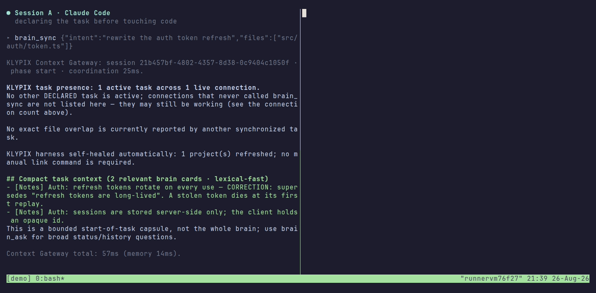

# Every project gets a brain.

Shared project memory for **Claude Code, Codex, Cursor** and other MCP coding tools. One
`brain.klypix` file, committed with your code, carries the project's decisions, corrections and open
questions across sessions and between tools. Corrections supersede stale decisions; sessions declare
the files they expect to touch and get warned about same-machine overlap. Versioned in Git. Served
over MCP by a process on your machine; Klypix uploads nothing (your agent's provider still receives
what the agent reads). Integration depth differs by host — see
[Supported hosts](#supported-hosts-and-their-integration-level).



<sub>Real output, not a mockup: both panes run a real MCP client against this server
([docs/demo/](docs/demo/) — the GIF is rendered by CI from a scripted tape against this server, not
hand-recorded, and re-rendered when the server's responses change).</sub>

Run this inside your project:

```bash
npx klypix-mcp install
```

It creates `brain.klypix` if the project has none, wires the editors it finds on this machine,
registers the `.klypix` merge driver if this is a git repo, and exits only after a real MCP
handshake has counted the tools that answered.

[](#supported-hosts-and-their-integration-level)
[](#supported-hosts-and-their-integration-level)
[](#supported-hosts-and-their-integration-level)
[](#supported-hosts-and-their-integration-level)

<sub>Host badges name the **integration level**, not a flat "compatible" — the levels and what is
actually tested are in [Supported hosts](#supported-hosts-and-their-integration-level).</sub>

> **One project. Many agents. One current understanding.**

Klypix does not launch, run, supervise, or replace your agents. It is not an agent runtime, a model
router, a worktree manager, or a replacement for Git. It holds what the project currently believes.

[](https://github.com/dahshanlabs/klypix-mcp/actions/workflows/ci.yml)
[](https://www.npmjs.com/package/klypix-mcp)
[](LICENSE)
[](package.json)
[](https://modelcontextprotocol.io)
[](https://glama.ai/mcp/servers/dahshanlabs/klypix-mcp)
[](BENCHMARKS.md)

## See the shared project brain in action

[](https://klypix.com/developers#demo)

Watch how current decisions, corrections, evidence, and active work stay visible to people and
carry forward into supported coding-agent sessions.

**[Watch the 2:21 showcase with sound](https://klypix.com/developers#demo)**

---

## The problem

You are running more than one coding agent on one codebase — a Claude Code session here, Codex in
another terminal, Cursor open on the side. Each one has excellent memory of *itself* and none of
the others:

- Every new session starts from zero, and you explain the same architecture again.
- Codex does not know what Claude learned an hour ago.
- One agent implements an approach the team already rejected, because the reason it was rejected
  lived in a chat that ended.
- Two sessions start changing the same files and nobody finds out until review.
- Git stores the code history. It does not store a reliable history of project *intent*.

Your agents may run independently. Their project understanding should not.

---

## 60 seconds: two agents, one project

Session A — Claude Code, in your repo:

```jsonc
brain_sync { intent: "rewrite the auth token refresh", files: ["src/auth/token.ts"] }
// → task-relevant memory capsule (bounded, ~2.8KB)
// → peers: none
```

Session B — Codex, same repo, half a minute later:

```jsonc
brain_sync { intent: "add rate limiting to the auth routes",
             files: ["src/auth/token.ts", "src/auth/routes.ts"] }
// → task capsule
// → peers: 1 active session (claude-code) — "rewrite the auth token refresh"
// → overlap: src/auth/token.ts — declared by both sessions
```

Session A gets the same overlap surfaced on its next KLYPIX action. Neither edit is blocked — the
warning is advisory, and both sides only see the overlap because both declared the files they
expected to touch.

Then the brain pushes back before the decision, not after:

```jsonc
brain_challenge { "move token storage to localStorage" }
// → "reversed on June 12 — here's the correction card, captured by a different agent."
```

And the decision is kept where the next session will find it:

```jsonc
brain_note { text: "Token refresh moves to an httpOnly cookie; localStorage was reversed 2026-06-12." }
```

Prove all of this on your own machine, against the exact build you installed, with two real
isolated MCP clients:

```bash
npx klypix-mcp conformance
```

It runs in a temporary fixture and touches nothing else. It checks tool discovery, task memory,
truthful peer reporting, overlap surfacing, proactive logging, and in-band delivery of a peer note.
It verifies 15 required coordination behaviours — not the 25 tools, and not the retrieval engine.

---

## Quick start

**You need Node.js 20 or newer** (`node -v` to check). Every way of connecting runs the server with
`node` — `npx`, the installed bundle, and the entry KLYPIX's Settings buttons write — and none of them
checks for Node first.

Run this **inside your project**:

```bash
npx klypix-mcp install
```

One command for supported editors detected on this machine. It finds the project root (walking up,
so running it from `src/` is fine), gives the project a brain if it doesn't have one, wires the
agent tools you actually have installed, registers the card-level `.klypix` merge driver if it's a
git repo, and then **proves the result** before it exits:

```text
  project   E:\work\api  (git repository root)
  brain     created brain.klypix — a starter brain, ready for its first decision
  editors   Claude Code · Cursor · Codex · Gemini CLI · Antigravity · VS Code
  wired     9 file(s) · 9 updated   (skipped 5 for tools you don't have)
  git       .klypix merge driver registered
  verified  ✓ 25 tools reachable via .mcp.json (892ms)
```

That last line is the point. MCP config fails **silently** — a wrong entry means the server never
starts, the agent quietly loses every brain verb, and nothing reports an error. So `install` opens
a real stdio handshake against the config it just wrote and counts the tools that answered. A
broken entry dies in ~100ms with `Connection closed` and is reported, not shipped.

What goes where:

- **Machine-global, once** — the engine + runtime in `~/.claude/project-brain`, Claude Code's five
  lifecycle hooks in `~/.claude/settings.json`, and the `~/.codex/AGENTS.md` guidance block. Claude
  Code is therefore covered in every project on that machine that has a `./brain.klypix`.
- **Per project** — MCP config and rules for Cursor, Codex, Cline, Windsurf, Copilot, Gemini CLI /
  Antigravity and Aider. Run `install` once inside each project.

Three things it deliberately will **not** do:

- **Write for editors you don't have.** Config is projected only for hosts detected on this
  machine — a two-person team using one editor no longer commits rules for six they never opened.
  A file your project *already* carries stays maintained regardless, so you can't silently stop
  updating your team's committed configs.
- **Wire a directory that isn't a project.** It refuses your home folder, a drive root, and
  anything with no brain, no git repo and no project manifest. A mistyped command can't seed a
  brain into `C:\Users\you`.
- **Replace a project-owned server.** A repo-relative launch like
  `node scripts/klypix-mcp-server.mjs` is deliberate — it resolves offline and rides a bundle the
  repo version-gates — so it's left byte-identical and reported. An explicit `link` still rewrites
  everything: an action you didn't ask for stays more conservative than one you did.

Opt out with `--no-project` (CI images, scripted provisioning). `--json` emits the report as
structured data; `--verify-all` handshakes every written config instead of one.

Optional, opt-in, and approved inside Codex itself:

```bash
npx klypix-mcp install --codex-hooks
```

Six Codex lifecycle hooks that add automatic per-prompt context injection and a pre-edit
file-overlap warning. Codex owns the trust decision and will ask you to review them.
`brain_doctor` reports this layer separately as off, execution-unverified, or active. Even with it
on, **Codex never captures decisions automatically** — the Codex hook never writes the brain.

**Re-project everything explicitly:**

```bash
npx klypix-mcp link
```

`install` already does this for the editors you have. Reach for `link` when you want all 14
managed, hash-stamped files regardless of what's installed — MCP server config for six hosts plus
rules files for eight — or to repair drift. Managed blocks are merged into your existing
instruction files and never clobber your content.

```bash
npx klypix-mcp link --check    # audits without writing; exits non-zero on drift
```

> Either form works, and both are safe in CI: `npx -p klypix-mcp klypix-link --check` used to
> drop `--check` and write anyway — fixed, and locked by `test/cli-args.mjs`, which asserts the
> standalone bin and the dispatcher parse arguments identically.

**Give a project a brain** by dropping a `brain.klypix` into it — the
[KLYPIX app](https://klypix.com) does it in one click (*Save canvas as project brain*), or
`create_canvas` makes one from any agent.

---

## How the brain works

The difference from a folder of notes is not the shape — it is that this memory is a mechanism,
not a filing convention.

- **Decisions have a lifecycle.** A new decision that contradicts an old one supersedes it. The
  stale card is archived with an arrow and a date, never deleted, and later answers surface the
  correction rather than the corpse. If a later decision returns to an earlier superseded stance,
  high-confidence lineage leaves a dated `re-adopts` stamp on the new card plus an earlier→current
  edge; the original A→B→C history remains intact.
- **Corrections are explicit, not guessed.** Supersession fires on an UPPERCASE correction cue or
  an explicit edge. `brain_reconcile` only *proposes* stale-vs-correction pairs for a human to
  confirm.
- **Cards can cite the code they were decided against.** An `ev:` anchor records a file:line plus
  the git blob OID at capture time, so the engine can flag a card whose cited code has since moved
  on. It detects that the code *changed* — never that the claim became false.
- **Position means something.** Drag a card into the 📌 Focus area and it leads every future
  session's brief. That is brief priority, not a retrieval-ranking boost.
- **You can ask what the project believed then.** `brain_ask` with `as_of: 2026-03-01` reweights
  ranking by card lifecycle dates, so corrections made later do not leak backwards.
- **Retrieval is local.** Lexical by default. If the optional on-device model is installed,
  `brain_ask` and `search_all_brains` use BGE semantic ranking with lexical help for exact
  identifiers, paths, and versions — still entirely on your machine. The previous cross-encoder
  is available for experiments with `KLYPIX_RERANK=1`, but is off by default because it reduced
  precision and added latency on the frozen human-paraphrase evaluation. Without the embedding
  model, retrieval degrades cleanly to lexical. `npx klypix-mcp install` deliberately does not
  install that model, so a fresh install is lexical.

### Bounded semantic-memory runtime

Long-lived MCP and A2A workers use the bounded semantic-memory runtime by default. Models load only
when semantic work is requested, native inference is serialized per process, embedding work is
split into small batches, and temporary tensors are released after use. Loaded models retire after
an idle interval and transparently reload on the next semantic request, so warm queries stay fast
without permanently pinning native model memory. These controls change the resource lifecycle only;
brain cards, project coordination, and the on-disk brain format are unchanged.

The previous runtime remains available as an emergency rollback. Set
`KLYPIX_SEMANTIC_MEMORY_MODE=legacy` in the MCP server environment and reconnect or restart the
host. This restores eager model prewarming and the previous inference path without migrating or
deleting brain data. Remove the variable (or set it to `bounded`) to return to the bounded runtime.

Run the deterministic lifecycle tests with `npm run test:memory`. For an opt-in real-model soak
against a disposable or backed-up brain, set `KLYPIX_MEMORY_SOAK_BRAIN` to its path and run
`npm run test:memory:soak`.

For process-level attribution, run `npx klypix-mcp runtime` (or add `--json`; `--watch 30` samples
every 30 seconds). It reports KLYPIX workers, supervisors, and legacy launcher overhead separately,
excludes the owning IDE/chat application's RAM, redacts command-line secrets, and never opens a
brain or terminates a process. Multiple processes under one host are reported as parallel sessions,
not called duplicates without an authoritative logical-session receipt.

### Project Map: current structure beside project understanding

If the project contains a compatible NetworkX node-link `graph.json`, agents can ask for bounded
code-structure evidence and current brain context in one read-only call:

```jsonc
project_map_context {
  "question": "what owns refresh-token rotation?",
  "graph_path": "graphify-out/graph.json"
}
```

Use `compare_to` with another project-relative graph artifact to add exact total node/edge deltas
and additions/removals from the two bounded query neighborhoods. Both paths are confined to the
declared project root; unsafe source paths are withheld; large or unsupported artifacts are
rejected. When a returned brain card names an exact mapped source path, the structured response
also includes a review-only evidence-link proposal. It never promotes similarity into truth and
never writes graph facts or links into `brain.klypix`.

Graphify is the first compatible producer. KLYPIX reads artifacts that users generate separately;
it does not bundle, install, or run Graphify and does not imply a partnership. A compatible generic
`graph.json` works through the same provider-neutral boundary.

For a reproducible map artifact on every pull request and main-branch push, install the shipped
read-only workflow into a Git checkout:

```bash
npx -y -p klypix-mcp klypix-project-map setup-github /path/to/project
```

The command refuses to overwrite an existing workflow unless `--force` is explicit. The installed
workflow has `contents: read`, pins every action by commit SHA, pins `graphifyy==0.9.33`, validates
the graph contract, and uploads `graphify-out/` as a 14-day build artifact. This is opt-in CI code:
the local MCP tool still never installs or launches Graphify.

---

## Supported hosts and their integration level

Levels are honest. Only the config-writing side is tested for the `link` hosts; their host-side
behaviour is unverified.

| Host | Level | Wired by | Brief into context | Decision capture | Live presence |
|---|---|---|---|---|---|
| **Claude Code** | Full automatic (5 lifecycle hooks) | `install` | Automatic at session start, task-ranked retrieval per prompt | **Automatic** at turn end | Yes |
| **Codex** | Native MCP + presence + Context Gateway; optional `--codex-hooks` | `install` | Via `brain_sync`; per-prompt injection only with `--codex-hooks` | **Explicit only** (`brain_note`) — never automatic | Yes |
| **Cursor** | MCP config + always-on rules file | `link` | Model must call `brain_sync` | Model must call `brain_note` | For the MCP connection |
| **Cline** | MCP config + always-on rules file | `link` | Model must call `brain_sync` | Model must call `brain_note` | For the MCP connection |
| **VS Code (Copilot / Continue)** | MCP config + instructions file | `link` | Model must call `brain_sync` | Model must call `brain_note` | For the MCP connection |
| **Gemini CLI / Antigravity** | MCP config + always-on rules file | `link` | Model must call `brain_sync` | Model must call `brain_note` | For the MCP connection |
| **Windsurf** | Rules file only | `link` | Reaches the tools through Windsurf's own global MCP config | Model must call `brain_note` | Via its own MCP config |
| **Aider** | Rules file only (no MCP) | `link` | CLI path: `npx -y -p klypix-mcp klypix-read` | CLI path: `npx -y -p klypix-mcp klypix-append` | — |
| **Claude Desktop** | One-time config: KLYPIX's Settings button, or a manual edit | KLYPIX app or you | Model must call `brain_sync` | Model must call `brain_note` | For the MCP connection |

`install` and `link` are different things and are not interchangeable: `install` sets up the
machine engine and hooks, then wires supported hosts detected for this project (see *Quick start*).
`link` is the explicit per-project repair/projection path for all 14 managed files, regardless of
which hosts are installed.

**Claude Desktop** — in the KLYPIX desktop app, Settings → Project → **Connect Claude Desktop**
writes this entry for you; or add it to `claude_desktop_config.json` by hand. Either way it needs
Node.js on the PC, and Claude Desktop must be quit completely (tray icon → Quit) and reopened before
it lists the tools:

```json
{
  "mcpServers": {
    "klypix": {
      "command": "npx",
      "args": ["-y", "klypix-mcp", "--vault", "/absolute/path/to/canvases"]
    }
  }
}
```

---

## Running as a Claude plugin

The KLYPIX Claude plugin starts this server as `npx -y klypix-mcp@1.93.0`: one exact version, never
a range or `latest`. It sets three variables: `KLYPIX_PLUGIN=1`,
`KLYPIX_PLUGIN_DATA=${CLAUDE_PLUGIN_DATA}` and `KLYPIX_VAULT=${CLAUDE_PROJECT_DIR}`.
`KLYPIX_PLUGIN=1` turns on **plugin mode**, which changes how the MCP server behaves and nothing
else. Every `npx klypix-mcp` command (`install`, `link`, `doctor`, `sessions` and the rest) works
exactly as described elsewhere in this README. Only `KLYPIX_PLUGIN=1` turns plugin mode on;
`CLAUDE_PLUGIN_ROOT` on its own does not.

**What plugin mode never does**

- **Update itself.** It never asks npm for a newer release and never installs one, whatever
  `KLYPIX_AUTO_UPDATE` is set to. You run the version the plugin pins, and a newer version reaches
  you only in a new plugin release.
- **Run code from outside the package.** It runs only the worker inside the pinned package. It
  never starts or switches to the copy that `npx klypix-mcp install` puts in
  `~/.claude/project-brain`, and it never loads the optional on-device semantic model from that
  folder. Search is keyword-only, so it never downloads model weights.
- **Write project config files.** It never creates or rewrites rules files, editor MCP configs
  (`.mcp.json`, `.cursor/`, `.codex/config.toml` and the rest) or the `AGENTS.md` brief block, in
  this project or any other. Outside plugin mode, `brain_sync` and the updater do write these files;
  *Security and permissions* explains when.
- **Change Claude's settings.** It never writes `~/.claude/settings.json`, hooks, permissions or any
  other host configuration.
- **Collect data or read credentials.** It sends no telemetry or usage data, reads no API keys or
  tokens, and opens no network port.

**Network.** Plugin mode makes two kinds of request, and both go to the public npm registry. The
first is npx downloading the pinned package when the plugin starts the server. The second is one
`npm view klypix-mcp version`, and it runs only when an agent calls `brain_doctor` with
`check_npm: true`. There are no other requests.

**Programs it runs on your computer.** Read-only `git` commands in your project (current branch,
tags, log) for coordination and release checks. Also `brain_reopen`, described at the end of this
section.

**What it reads.** In your project: `brain.klypix`, the `.klypix` canvases, the `version` field of
`package.json` and your git tags. On your computer: the coordination files in the table below. If
the KLYPIX desktop app is installed, it also reads the app's data folder (`%APPDATA%\klypix`),
read-only, to see whether the app is running, which canvases it has open, and the readings it saved
on cards. It never reads chat history, transcripts or Claude's memory.

**What it writes, and where**

| Where | What | Why |
|---|---|---|
| Your project | Only what a tool call asks for: `brain.klypix` (`brain_note` and the other brain tools), canvases (`create_canvas`, `add_to_canvas`), `klypix-map/graph.json` when `project_map_scan` is called, and `.klypix/claims/<owner>.json` when `brain_sync` is asked to publish a release claim. During a brain write it holds `.claude/brain-capture.lock`, creating the `.claude/` folder if the project has none. The lock file is deleted after the write; the folder stays. Creating a canvas briefly holds `.klypix-create.lock` in the folder. | The KLYPIX app and every other session that writes the brain use the same locks, so two writers never overwrite each other. |
| The plugin's data folder (`KLYPIX_PLUGIN_DATA`) | Connection receipts (`.supervisors/`), the running-server heartbeat (`.running-servers.json`), the list of projects whose brains you used (`registry.json`, which `search_all_brains` reads), and the last version and git tag seen in each project (`ship-observations/`). | Only this server uses these files. If `KLYPIX_PLUGIN_DATA` is not set, or still contains a `${...}` that was never filled in, it uses `CLAUDE_PLUGIN_DATA`. If neither is usable, the files go in `~/.claude/project-brain`. |
| `~/.claude/project-brain` (shared) | Presence lanes (`sessions/`), write locks (`locks/`), restore points (`history/`), and small records built from your brain: `.capture-gap.json`, and `enrichment/`, `provenance/`, `.brief-cache-*` and `.guards-*` when the tools that use them run. | Your other KLYPIX sessions on this computer (Claude Code, Codex, Cursor, the app) use the same files on purpose. Through them, a plugin session and a terminal session on the same project see each other, get warnings when they plan to edit the same files, and pass notes. Restore points are kept here so that `npx klypix-mcp brain-history` can still undo a brain write after you remove the plugin. |

**`brain_reopen`.** Sometimes a session leaves a note for another session that has already closed.
An agent can then call `brain_reopen`, and KLYPIX asks you first: in chat with *Reopen* and *Not
now* buttons, or in a small dialog (PowerShell on Windows, osascript on macOS, zenity or kdialog on
Linux). Only if you choose *Reopen* does it open a new, visible terminal that runs the app's own
resume command, `claude --resume <id>` or `codex resume <id>`. *Reopen on your OK* has the details.

**After you uninstall the plugin.** Claude Code removes the plugin and deletes its data folder.
These stay: your brain and canvases, which belong to you; any `.claude/` folder a brain write
created in a project; and the presence lanes, write locks and restore points in
`~/.claude/project-brain`. Other KLYPIX tools on this computer share that folder. If you use none,
you can delete it.

---

## Task briefing

Every Claude Code session starts already knowing the project: a bounded brief of at most 2KB in
context, with the full brief written to disk for when broad history or status work needs it.

Every other host gets a bounded ~2.8KB task capsule from one `brain_sync` call, plus a compact
always-loaded `AGENTS.md` block that tells the agent to make that call at task start, when scope
changes, and on completion. The gateway capsule is lexical-fast by design. A newly captured open
gap can claim a labeled `RECENT OPEN` slot only after clearing the normal lexical-relevance floor,
so fresh relevant findings are not crowded out by older area vocabulary.

Briefs are **not** injected automatically on Cursor, Cline, Copilot, Gemini CLI or Antigravity —
there are no lifecycle hooks on those hosts.

## Capture and corrections

`brain_note` accepts structured supporting references and inert verification text:

```json
{
  "text": "Retry failed uploads with a bounded backoff to preserve queued work.",
  "area": "Storage",
  "evidence": [{ "kind": "file", "ref": "src/uploads.mjs:42" }],
  "verify": "node test/uploads.mjs"
}
```

File references must stay inside the project. The capture records a fingerprint of the
working file and, when available, the repository HEAD revision. An unchanged fingerprint
means **source unchanged**, not that the remembered claim is correct or that tests passed.
Dirty working files are fingerprinted as they are; HEAD alone does not describe those bytes.
Read results distinguish changed, missing, and unverified sources. External references
(`pr`, `url`, `commit`, `run`) are retained without fetching or verifying them. `verify` is
shown as recorded text and never executed. Optional `verifiedAt` is explicitly caller-reported.

On an amendment (`marker: "~"`), omitted metadata is preserved; `evidence: []` and
`verify: ""` clear obsolete metadata. A resolve (`✓`) archives existing evidence; attach
new evidence with a milestone and `closes`, or amend before resolving. The CLI accepts the
same JSON on stdin, or `--evidence '<JSON array>'` and `--verify '<text>'`.

On Claude Code, decisions are captured automatically at turn end from inline `🧠 BRAIN [Area]:`
markers in the transcript, deduped, under a capture lock.

A marker can end with optional suffixes, in any order: `closes: <card title or [[wikilink]]>`,
`ev: <file[:line]>, PR#<n>`, `verify: <command>` and `q: <the question this answers?>`. They count
only as one run at the end of the line, written lowercase as `key: value`, and each value must
have its key's shape: references for `ev:`, a command for `verify:`, a question (question word
first, `?` last) for `q:`. Anything else is kept as card text, so "a Q: and A: layout", "the ev:
field" or "every agent verify: the tag" never cuts a note short. A malformed segment after a
well-formed one also stays in the text, and the other suffixes still count; the hook tells the
agent on its next prompt. On `✓` and `~` markers a `closes:` is plain text, because those markers
close nothing. A `closes:` that will not act keeps the sentence as written: it names no live card,
or it names more than four. A `closes:` that does not come after the end of a sentence, a
`[[wikilink]]` or another suffix closes only a card it names by title. One whose named card is
already closed closes nothing else. A `~` update too thin to replace its card (fewer than six
content words and under half the card's) is appended to that card as a dated `(~ amended …)` line
instead. The card keeps its date, colour and probe, and previews show the newest amendment first.
The correction lands and nothing is lost.

The Stop hook reads the whole transcript every time, so a `~` or `✓` line applies once. A marker
that an older hook (1.85 or 1.86.0) already captured is not captured again after an upgrade. If
1.86.0 cut the note short, the stub is restored to the full text in place. When a marker does not
do what it says, the next prompt tells the agent. A receipt left by a session that has ended goes
to the next session that starts in the project.

On every other host, capture is explicit: `brain_note` runs the same capture engine as the hooks —
dedup, supersession, round-trip re-adoption receipts, `✓` resolve, `~` update in place, `+` skill,
`closes:` — and stamps which agent wrote the card. A `✓` question preference ranks only candidates
that already clear raw lexical overlap and two subject-identity anchors; generic lifecycle wording
cannot turn weak overlap into a closure.
(If you install the git commit hook from the KLYPIX app or run `npx klypix-mcp git-hook install`,
commit messages also capture automatically for any agent.)

`brain_challenge` is the other direction: propose a decision and the brain answers with receipts —
prior decisions that deterministically contradict it, standing rules that dispute it, and
approaches tried and reversed, flagged when a different agent wrote them. Evidence is deterministic
only (explicit correction cues, opposite-polarity pairs), never mere topical similarity. Silence
means no contradiction signal was found — not verified consistency. A memory that cannot disagree
with you is flattery.

## Presence and task intent

An active session means an authorized MCP connection or host lifecycle adapter that heartbeated
within the TTL. A row in a recent-chat list is history, not presence.

Each MCP connection registers itself at initialization and removes itself on disconnect; the TTL
covers crashes. Optional host adapters merge into that same logical session rather than
double-counting it, enrich it with intent and files, and remove only their own channel. Sessions
that never declared a task are still counted, but are shown separately as scope-unknown rather than
padding the peer list.

Future hosts get baseline support merely by connecting the MCP server. A deeper adapter can import
`klypix-mcp/presence` and map lifecycle events onto `upsertSession`, `removeSession`,
`peekMessages` and `receiveMessages`. The shared contract accepts `id`, `client`, `surface`,
`model`, `branch`, `intent`, touched `files`, and adapter `channel`.

## Overlap warnings

When two sessions declare overlapping expected files, `brain_sync` surfaces it: the peer, its
declared task, and the exact paths in common. A one-time alert is queued to whichever session got
there first, so a late arrival is not the only one who knows.

This warns. It does not prevent. Nothing blocks an edit, matching is exact-path, and both sides
have to have declared their files for the overlap to be visible at all.

## Handoffs and messages

`brain_message` leaves one-time coordination notes for other sessions — live, idle, or recently
closed. Address a session by id: a live session gets the note on its next action; a session
KLYPIX has identified before that is **not on the lane now** (closed, or quiet) still receives a
directed note the moment it next acts — a directed note is kept 7 days, and the sender is told it
is *queued*, not delivered. That is what stops the human from being the courier between two
agents: the standing rule every host receives is that a message it would otherwise ask the person
to relay or paste is sent this way instead. Nothing here starts or wakes a session on its own — the
note waits until a person opens it, and the person decides when that is (see *Reopen on your OK*
below). A supported
KLYPIX action offers the note in model-visible context; the next independent supported action
replays it and records an acknowledgement. That acknowledgement proves only that a later action followed the
offer — never that a person read it or that an agent acted on it. The note keeps replaying until the
receiving model calls `brain_message_receipt` with the exact message id and per-recipient offer
token; only that token-bound action records `consumed`. Pending, offered, and acknowledged notes
survive reconnects. Expiry or bounded-capacity eviction records a failed per-recipient receipt
instead of silently looking delivered. The send-time audience is fixed, unresolved targeted sends
fail closed, the core lane is machine-local, a note to every session expires after 24 hours and a
directed note after 7 days, and notes are never written into the brain.

### Reopen on your OK

A note to a session that has closed would otherwise wait until someone happens to open that
session again. When the person wants it handled sooner, the sending agent calls `brain_reopen`, and
**KLYPIX asks the person** — an in-chat *Reopen / Not now* prompt in apps that support MCP
elicitation (Claude Code, Codex), otherwise a small native dialog. Only on *Reopen* does KLYPIX
open that Claude Code or Codex session in a **new, visible terminal**, in the folder it worked in,
with the host's own resume command (`claude --resume <id>`, `codex resume <id>`); the session
receives the waiting note at its first action and the sender sees the receipt as usual.

- The person decides, never a model: the answer comes from the app's prompt or KLYPIX's own
  dialog, which no agent can click. With neither available, nothing opens and the person is given
  the command to run.
- Only a session with a note **addressed to it** is reopened — KLYPIX reopens a conversation so a
  note can reach it; it does not start, route or supervise agents.
- The first prompt the reopened session gets is fixed text that tells it to collect the note; the
  note itself arrives through the labelled message channel as information from another session,
  never typed in as if the person had said it. The sender's session identity never leaks into it.
- *Not now* is remembered: the same session is not offered again for a while, and a double click
  cannot open two windows.
- From a terminal: `npx klypix-mcp sessions` lists this project's closed sessions and the notes
  waiting for them; `npx klypix-mcp sessions reopen <id>` reopens one (`--quiet` lets it wait for
  you instead of starting on the note).

Durable handoffs go in the brain itself — decisions, findings, open questions and skills captured
as cards, each stamped with the agent that wrote it.

## Evidence-gated completion

When a task publishes a quantified or otherwise machine-checkable claim, it can attach one or more
versioned result manifests to `brain_sync { phase: "complete" }`. Each manifest binds the claim to a
report hash, producer/run provenance, the exact declared task scope, material artifact hashes,
evaluation outputs, public metric wording, input/configuration fingerprints, and named metrics with
counts and tolerances. Matching peer evidence is recorded as corroboration; conflicting or
incomparable evidence returns `needs-reconciliation` and keeps the task scope active.

The gate fails closed. Once a task submits result evidence, it cannot bypass an invalid or
conflicting result by retrying completion without the manifest, and that obligation survives worker
restart, hibernation, and transparent hot-swap. A fresh `phase: "start"` is the explicit boundary for
a new task. The strict schema and reusable validator are exported as `klypix-mcp/result-reconcile`.
Schema-v2 receipts can be converted into commit-bound publication evidence and independently checked
with `klypix-mcp/release-evidence`; legacy schema-v1 results remain usable for coordination but cannot
authorize publication.

## Human control in Klypix

> **Not a second brain. A shared one.**

A brain nobody can inspect is a database with good marketing. The
[KLYPIX desktop app](https://klypix.com) renders the same `brain.klypix` as a living spatial map,
with health, freshness, provenance and orrery lenses, an unresolved-questions triage view, and a
one-click flow that connects a folder's brain to six coding agents. You can read, correct, archive
and re-link what your agents recorded.

The file is co-owned. When the app saves a brain it re-reads the disk copy inside the same capture
lock the agent hooks use and union-merges instead of overwriting, so a card an agent captured while
you had the file open is kept. The merge verifies its own output and aborts rather than emit a file
missing a card. Deletes require an explicit tombstone, so a card that is merely absent is never
inferred as deleted.

The app is a separate, proprietary Windows product. The format, this server and the hooks are
Apache-2.0 and work with no app installed. The app's interface is available in English and Arabic
(some newer panels are still English-only).

### KLYPIX canvases and your AI tool

Beyond project brains, the same connection reads and writes the KLYPIX canvases (spaces) saved on
your PC. **Your AI tool reads what KLYPIX has already read:**

- `read_canvas` prints every card with its id; `read_card_contents` returns what is inside a card
  from what KLYPIX saved — the transcript on a video card, the text card **Read contents** made for a
  reel or web page, an OCR card for a photo, a folder's file list. For a reel or a video, choose Read
  contents in KLYPIX first (select the card, press Enter), let the canvas save, then ask your AI tool.
  This version does not start new readings itself.
- What a person set up in KLYPIX is respected: cards inside a box **locked from AI tools** are left
  out of every read; frozen cards are marked read-only; collapsed boxes, comments and tags are shown.
- `klypix_status` tells your AI tool what KLYPIX can do on this PC right now, and which step the person
  has to take.
- **A canvas that is open in KLYPIX is not written.** KLYPIX builds that write the open-canvas lease
  (`%APPDATA%\klypix\agent-bridge\endpoint.json`, no secret in it) make `add_to_canvas` refuse
  that canvas and say why; project brains are the exception, because KLYPIX merges them. With an older
  KLYPIX, `add_to_canvas` writes and its reply tells the person to close the canvas's tab and open it
  again.
- Text that comes back from cards, pages, reels and files is fenced as data, never instructions.

## Measure it yourself

Claims about a shared brain — "nothing is lost", "it stays fast" — are unfalsifiable until a
stranger can re-run them, so the benchmark ships in the box:

```bash
npx klypix-mcp bench            # ~25s, or --quick for a smaller run
```

It measures concurrent-write safety across real OS processes, coordination latency, a 1,000-query
soak with drift, and crash safety under SIGKILL — then prints the machine it ran on.

**It runs a negative control first.** Writers that bypass the lock go in before the real ones,
because a "0 lost" number means nothing unless the same harness can *see* a loss. On the reference
machine those unlocked writers lost 17 of 22 cards; the same contention through the lock protocol
lost 0 of 46. If the control ever loses nothing, the run reports **inconclusive** instead of a pass.

Latest results, with hardware and date: [BENCHMARKS.md](BENCHMARKS.md).

## Git and concurrency

One file in your repo, committed with your code — versioned, branchable, portable. So two
developers already share one brain the way they share code: clone, branch, pull.

Be precise about what git does on its own: `brain.klypix` is a binary ZIP. Git shows
`Bin 1308328 -> 1309005 bytes` and produces zero line diffs, so out of the box a conflict on it is
an all-or-nothing take-ours or take-theirs, and a reviewer sees nothing. **Card-level merge safety
comes from the KLYPIX engine** — but since 1.48.0 you can hand that engine to git and read its
output in a PR:

```bash
npx klypix-mcp git-driver install     # once per clone, in any repo
```

That registers a merge driver for `*.klypix` (a per-machine git config line plus a `.gitattributes`
rule you commit) and provisions the engine it needs. When two people change the brain and one
pulls, git calls the engine instead of stopping: new cards from both sides are kept, a card only
one side edited takes that edit, and a card edited differently on both sides keeps **both**
versions — the second as a linked twin, never a silent overwrite. (One exception to "takes that
edit": a card is never changed to mean exactly what its own conflict twin beside it already means
(the whole card, not only its words) — both versions stay as they are and the driver's summary line
says so. Delete the one you do not want.) Deletions travel too: a deleted
card leaves a receipt in the brain's Deleted cards, and the driver merges those three-way, so a
card deleted — or permanently deleted — on one branch stays out instead of coming back from the
other, unless the other branch edited it. That edit comes back as a new card when the deleting
branch recorded the delete (a receipt in its Deleted cards); when it did not, the edited card
simply stays. A permanently deleted card stays out even then: the driver's summary line counts the
edits it dropped, and they remain in that branch's git history. Before returning, the merge asserts
it still contains every surviving card from both sides and refuses rather than hand back a result
that lost one.

The honest boundary: a machine that has not run `git-driver install` simply gets the old binary
conflict — safe degradation, not corruption — and git keeps both parents of every merge, so even a
merge you dislike is reconstructable. It is a merge *on pull*, not live sync.

For review, two commands turn a binary blob into something a human can read:

```bash
npx klypix-mcp diff main            # card-level: what was added / updated / removed
npx klypix-mcp pr-brief origin/main # the brain cards that reference this PR's changed files
```

`diff` compares meaning rather than bytes (a re-save restamps timestamps; that is not a change).
`pr-brief` matches a card's `#file-…` evidence anchors against the changed paths, so a reviewer
sees the decisions already recorded about the code in front of them. `examples/github/brain-pr.yml`
wires both into a sticky pull-request comment using nothing but the checkout and the default
`GITHUB_TOKEN` — no KLYPIX service in the path.

Concurrent sessions serialize behind a capture lock, and each write is a temp file plus an atomic
rename, so a crash mid-write leaves the previous good file intact. The lock is advisory with a
~3.6-second budget: past that, a writer proceeds anyway and flags it in the health log, so
sustained contention can still lose an update. That is a deliberate trade — dropping the markers
was judged worse — but it is a real limit, not a guarantee.

### Restore points

Merging, tidying and gardening are built to keep every card nobody deleted (one deliberate exception: a
card deleted permanently also leaves the other copies of the brain when they sync, an edited copy
included, and the merge reports that edit). Deleting permanently is not a guarantee that the text is
gone everywhere: a copy of the card that someone restored on another machine at about the same time,
or resized or edited after restoring it, can stay there and has to be deleted there too; and restore
points and git history keep what they already held. What none of them can undo is a
*deliberate-looking* deletion: you select a dozen cards, delete them, and save. That is not a bug
to prevent — a brain has to stay correctable, and an uncorrectable memory is worse than none — but
it deserves a way back, because the brain is **co-owned**: hooks, the MCP server, commit capture
and peers on other machines all write to it while nobody is watching, so you can destroy work you
never saw arrive.

So every brain write takes a restore point of the previous bytes first:

```bash
npx klypix-mcp brain-history list          # age, card count, delta against the brain now
npx klypix-mcp brain-history restore <id>  # and this is itself undoable
```

A restore is a merge into the brain as it is now, not a copy over the file, and it prints what it
changed. The point's cards come back — a card deleted since returns under a new id, so every other
copy of the brain agrees the old one was deleted — and cards written after the point move to
Deleted cards (`npx klypix-mcp brain-deleted list`), where each one can be restored. Permanently
deleted cards stay out unless you pass `--include-purged`.

They live under `~/.claude/project-brain/history/`, never beside the brain — nothing lands in git,
in the merge driver's path, or in your diffs, and they survive deletion of the `.klypix` file
itself. Routine writes are deduped and throttled to one a minute; a write that **removes cards** is
never throttled, because that is the case they exist for. Retention is the newest 20 plus one per
day for 14 days, so a slow-burn mistake is still recoverable without unbounded growth. A snapshot
that cannot be written is logged and skipped — it never blocks your save.

Normal canvases deliberately get none of this. One human made every mark and saw every change; the
brain is the file where that is not true.

---

## The command line

The MCP verbs below are what agents call. These are what **you** call:

| Command | What it does |
|---|---|
| `npx klypix-mcp init` | Seed a starter `brain.klypix` here and print an MCP config |
| `npx klypix-mcp install` | Set up everything: machine engine + hooks, then this project — brain, config for the editors you have, merge driver, verified (see Quick start) |
| `npx klypix-mcp link` | Re-project all 14 managed files regardless of what is installed (`--check` audits) |
| `npx klypix-mcp doctor` | One verdict: version, hosts, live sessions, tool count, drift. Exits non-zero — usable as a CI gate |
| `npx klypix-mcp runtime` | Passive per-connection process/RAM attribution (`--json`, optional `--watch seconds`); never kills or deduplicates |
| `npx klypix-mcp conformance` | Launch two real MCP clients against this build and verify coordination behaviour |
| `npx klypix-mcp git-driver` | Register the card-level `.klypix` merge driver for a repo (`status` to check) |
| `npx klypix-mcp git-hook` | Wire the agent-neutral commit-capture hook: rationale-bearing `feat`/`fix`/`perf` commits from any agent, branch, or worktree card into the brain at commit time (`install`/`remove`/`status`; sessions auto-install it where the hook slots are free) |
| `npx klypix-mcp brain-history` | Restore points for this brain — `list` them, `restore <id>` one. Written automatically before every brain write, kept machine-local, and never throttled away for a write that removes cards |
| `npx klypix-mcp diff [ref]` | Card-level brain diff against a git ref, as markdown |
| `npx klypix-mcp pr-brief [ref]` | Brain cards referencing the files changed since a ref, as markdown |
| `npx klypix-mcp garden-code` | Print the human approval code `brain_garden` requires |

---

## The 25 verbs

| Tool | What it does |
|---|---|
| `brain_ask` | Whole-brain question answering — correction-aware, `as_of` time travel |
| `brain_challenge` | The brain argues back: contradictions with receipts, tried-and-reversed chains, standing rules, other-agent provenance flags |
| `brain_note` | Capture with the full lifecycle — supersede / re-adopt / ✓ resolve / ~ update / 🛠 skill / `closes:` |
| `brain_reconcile` | Proposes stale-vs-correction pairs, unrecorded migrations, and the open cards a release ref's commits look to have closed — then closes the exact pairs you confirm |
| `brain_insights` | Hubs, orphaned decisions, stale questions, area sizes |
| `brain_lens` | Machine-readable freshness, provenance, activity, timeline, orrery and unresolved views |
| `brain_garden` | Maintenance pass — proposes first; consolidation cannot apply without an approval code the human generates. The separate `repair:"duplicate-partials"` pass is dry-run first and needs no code (it removes only exact repeats and archives nothing) |
| `brain_doctor` | Self-diagnosis: version, core/enhanced host adapters, active sessions, tool count, projection drift |
| `brain_message` | Session-to-session coordination notes — to a live session, or queued for one that is not running until it next starts — with a fixed send-time audience and per-recipient pending / offer / acknowledgement / consumption / failure receipts (a directed note is kept 7 days, a broadcast 24h; never written into the brain) |
| `brain_message_receipt` | Explicitly record model-side consumption using the exact message id and per-recipient offer token; acknowledgement alone never consumes a note |
| `brain_reopen` | Reopen a closed Claude Code or Codex session so a note waiting for it gets there now — only after the person answers *Reopen* in an in-chat prompt or KLYPIX's own dialog; opens a new, visible terminal in that session's folder with the host's resume command |
| `brain_sync` | Context Gateway: task capsule, active-task peers, exact-file overlap, one-time alerts, timing, and optional result-manifest reconciliation |
| `brain_connect` | Find and draw related-but-unlinked cards |
| `project_map_context` | Read-only, bounded code-graph evidence beside correction-aware brain context, with exact-path review proposals; external artifacts (e.g. Graphify) are supported but never installed or run locally |
| `project_map_scan` | KLYPIX's own zero-install scanner: gitignore-aware file inventory + file-level import edges (relative, tsconfig-alias, and monorepo-workspace imports resolved) written to `klypix-map/graph.json` — which then serves `project_map_context` automatically |
| `project_map_drift` | Read-only drift report: brain cards whose referenced files are gone or moved (with rename candidates), plus a headline when the checkout itself is behind its origin default branch |
| `canvas_view` | Returns the board as a structured render spec plus a text summary, and declares an MCP Apps (SEP-1865) UI resource |
| `read_canvas` | A canvas as markdown: every card with its id, the connection graph, `[[links]]`, `#tags` and tag pills, status, comments, reactions, frozen and collapsed boxes, and the readings KLYPIX already saved on link, video and photo cards; photo cards' images attached, each labelled with its card. Cards inside a box a person locked from AI tools are left out, and counted. Titles as KLYPIX shows them work as names |
| `read_card_contents` | What is inside up to 5 cards — a reel, YouTube video, web page, video or audio file, photo, document or folder — from what KLYPIX has already read: transcripts it saved on the card, its Read contents and OCR result cards, folder listings. Fenced as data, marked full or partial, with where it was made (this PC or cloud AI). A card KLYPIX has not read yet comes back with the one step the person takes in KLYPIX; this version starts no new readings |
| `klypix_status` | What KLYPIX can do on this PC right now: whether the app is running and which canvases it has open (from the lease file the app writes), where canvases are read from, and what each feature still needs from the person |
| `search_canvases` | Search across canvases by name, content, tags and tag pills, and the readings KLYPIX saved on cards; returns card ids and dates. Never searches inside a box a person locked from AI tools |
| `search_all_brains` | Cross-project memory search across every registered brain on this machine |
| `create_canvas` | New `.klypix` from cards + connections |
| `add_to_canvas` | Append cards/connections (positions preserved), bordered and readable on KLYPIX's dark and Paper themes; a card's `group` puts it in that titled box. Refuses a canvas open in KLYPIX (`OPEN_IN_APP`), a box locked from AI tools (`SCOPE_LOCKED`) or a frozen box (`FROZEN`), and writes nothing; project brains are the exception to the first. Returns the new card ids |
| `list_canvases` | List every `.klypix` in the vault |

Exactly 25 as of klypix-mcp 1.92.0, machine-verifiable with `npx klypix-mcp doctor`.

> **`canvas_view`:** no MCP Apps host has been observed rendering the UI resource yet — there is no
> screenshot and no host-level test. Hosts without the extension get clean text, which is the path
> that is actually verified.

`brain_doctor`, `brain_lens` and `brain_insights` are read-only introspection. `brain_reconcile`
is read-only too, with one exception: on `mode:"claims"` and `mode:"release"` you may pass
`confirm` / `dismiss` to close the pairs you verified. Confirm names exact card ids — nothing is
matched by prose — and covering only part of a multi-item clause writes `✔ partial` and keeps the
card open unless you pass `whole:true`. A call whose every entry is refused leaves the brain
byte-identical. A `dismiss` is recorded as a `not_fulfilled` edge between two CARDS, so a hint
whose only evidence is a raw commit has nothing to point at — name a `cardId`, or resolve the open
card itself. `brain_garden`, `brain_reconcile` and `brain_connect` always propose before they
apply.
`npx klypix-mcp doctor` gives one verdict and exits non-zero on drift, so it doubles as a CI gate.

## One file you can hold

The whole brain — layout, cards, arrows, and the actual bytes (images, PDFs, audio, video) — is a
single `.klypix` file: a plain ZIP with `manifest.json`, `canvas.json`, one JSON file per card, and
an `assets/` folder. Email it. Git it. Hand it to an agent. A folder of markdown points at its
attachments; this file carries them. (Binaries are embedded by the **KLYPIX app** when you drop a
file onto a canvas; this package's `create_canvas` / `add_to_canvas` / `buildKlypix` write cards and
arrows, not assets — they read assets fine, they just don't create them.)

The parser is this package, Apache-2.0, so any tool or agent can read and write the format. Full
spec: [FORMAT.md](FORMAT.md).

Markdown export, JSON Canvas 1.0 export and direct opening of Obsidian `.canvas` files are features
of the **KLYPIX desktop app**, not of this package — there is no export command among this
package's binaries.

**"Project" means any project.** Two showcase brains ship in the npm package *and* the GitHub repo
under [`examples/`](examples/), identical in engine, different in life:
[`showcase-brain.klypix`](examples/showcase-brain.klypix) is *Aurora*, a fictional weather app
mid-build (radar tiles, API caps, a correction with its receipt), and
[`showcase-wedding.klypix`](examples/showcase-wedding.klypix) is *Our Wedding* (venue, vendors,
guest list, the same correction machinery pointed at a caterer). Same 📌 Focus, same arrows, same
brief. If it has decisions worth keeping, it gets a brain.

They ship inside the tarball, so you can read one straight out of `node_modules`:

```bash
npm i klypix-mcp
npx klypix-read node_modules/klypix-mcp/examples/showcase-brain.klypix
```

Both are text-and-arrows only — 14 cards, 4 arrows, no `assets/` entry — so they demonstrate the
card / container / connection model, not the embedded-binaries half of the format.

## Use it as a library

```js
import { parseKlypix, buildKlypix, appendToKlypix, structToMarkdown } from 'klypix-mcp';
```

```bash
npx -p klypix-mcp klypix-read   path/to/board.klypix      # → markdown brief
echo '{ "title": "Plan", "cards": [{ "text": "kickoff" }] }' \
  | npx -p klypix-mcp klypix-write --out plan.klypix
```

## Also speaks A2A protocol v0.3.0 — experimental

```bash
npx -p klypix-mcp klypix-a2a --vault ./canvases     # 127.0.0.1:41241
# Agent Card: http://127.0.0.1:41241/.well-known/agent-card.json
```

Eight vault/project skills by default: `make_board`, `remember`, `learn_skill`, `recall`,
`read_canvas`, `list_canvases`, `brain_insights`, `brain_connect`. Machine-wide
`search_all_brains` is a ninth, explicit opt-in via `--allow-cross-project`. Unlike a typical A2A
agent that returns text, KLYPIX returns the `.klypix` board itself as a multimodal artifact. Details:
[A2A.md](A2A.md).

Treat this as a preview: the adversarial A2A smoke test runs in the default `npm test` chain, but
the server has not been exercised against a third-party A2A client.

## Updates — the propagation contract

The MCP entry point is a stable stdio supervisor that keeps the host-owned connection open while a
replaceable worker runs the brain core. A staged update is hash-verified, initialized in parallel,
checked for backward-compatible tool schemas, and handed the current `brain_sync` task scope before
the supervisor switches between requests. Added tools use the standard
`notifications/tools/list_changed` signal. A failed or breaking candidate is rejected while the old
worker keeps serving. A connection idle for 10 minutes releases its worker and keeps its presence;
it stays asleep until its host sends a request, and the new worker it then starts passes the same
checks. If they reject it, the connection resumes the version it last ran, or answers with a
retryable `/mcp reconnect` error rather than restarting in a loop. A blocked result claim is kept
in a durable per-project/session marker, so a worker replacement cannot turn a failed evidence
check into a result-less completion.

Compatible engine updates therefore activate behind the same live connection — no reconnect, no
host restart. Three cases still require a deliberate reconnect or manual install: the one-time
legacy→supervisor migration, a supervisor-code change, and a major or tool-removing release. Fixes
to the supervisor itself reach a connection only after one `/mcp` reconnect or a host restart;
worker and doctor changes hot-swap. `brain_doctor` reports the live supervisors (including how many
still run older supervisor code) and the automatic-update schedule: the last result, which install
it describes, and when the next check runs. The MCP tool also returns these as structured data.

The updater checks npm **once per machine every 6 hours**, however many sessions are open. It
checks once more, never sooner than 5 minutes after the last attempt, when another install upgrades
this runtime or moves it from a developer deploy to a released install. Examples are a manual
`npx klypix-mcp install` of a newer release, or a release replacing a developer deploy. A failed
check retries after 15 minutes, then 1 hour, then 4 hours, then returns to the 6-hour cadence. Each
attempt is recorded as failed before it touches the network, so a check that dies part-way backs
off instead of retrying in a loop. Checks run from the open KLYPIX sessions: the supervisor and
worker look every 10 minutes, and a new session looks 2 seconds after it starts.

The updater installs an exact stable release of the **same major version** in `--runtime-only`
mode, preserving host settings and project files; a new major always needs a manual install. It
never downgrades. A deliberate downgrade (`npx klypix-mcp@<older> install --force`) onto a release
newer than 1.89.0 is **held**: the updater does not re-install the version it was rolled back from,
only a newer release. To take the held version back, run `npx -y klypix-mcp@latest install` (or set
`KLYPIX_AUTO_UPDATE_FORCE=1` where `KLYPIX_AUTO_UPDATE` is set, below, for one check, then remove
it). A rollback onto 1.89.0 or earlier also rolls the updater back, and those releases have no
hold: they re-install the newest same-major release within 24 hours of their last check. To stay
on such a release, set `KLYPIX_AUTO_UPDATE=0` in every place listed below for as long as you stay;
`brain_doctor` warns when a downgrade is not held. The updater never fetches anything for a
developer-owned install and never installs over it. The check is detached and fail-open, and
concurrent sessions collapse behind one lock.

`KLYPIX_AUTO_UPDATE=0` opts out. Every process reads its own environment, so set it in each host's
launch environment: the `env` of each KLYPIX MCP server entry, and the environment Claude Code runs
its hooks in. It takes effect at that host's next supervisor start or `/mcp` reconnect.

There is one second, smaller probe. In a brain project (a directory with `./brain.klypix`), the
Claude Code Stop hook refreshes a local npm-version cache, which the next SessionStart reads to say
whether an update is available. That notice also says what the updater will do with the update,
and when. The probe:

- runs at most once a day, developer-owned installs included;
- makes the same kind of anonymous request the updater makes, a GET of
  `https://registry.npmjs.org/klypix-mcp/latest` that carries no user or machine identifier;
- is skipped while the updater fetched npm's latest version less than a day ago;
- is off with the same `KLYPIX_AUTO_UPDATE=0`, read from the environment Claude Code runs its hooks
  in;
- never installs anything.

When the optional semantic runtime is already enabled, an update also schedules one detached,
single-writer cache migration across registered brains. That removes the multi-minute first-query
re-index after a model/cache upgrade; cache writes are model-keyed and atomic across concurrent
agent sessions. Lexical-only installs download nothing. Set `KLYPIX_SEMANTIC_WARM_ON_UPDATE=0` to
keep lazy first-use indexing instead.

## Security and permissions

- **Apache-2.0, source public** at [github.com/dahshanlabs/klypix-mcp](https://github.com/dahshanlabs/klypix-mcp).
- **The brain engine makes no network calls and sends no telemetry.** All engine intelligence is
  deterministic and local; the only LLM anywhere is *your* agent. The exceptions in this package
  are the two update probes described above. One is the updater's npm version check, every 6
  hours, plus one re-check after another install upgrades the runtime, and retries after a failed
  check (15 minutes, 1 hour, 4 hours); when it finds a newer same-major release, it also runs that
  release's npm install. The other is the Claude Code Stop hook's version probe, at most once a day
  in brain projects. Both are the same kind of anonymous GET of the package's `latest` version, and
  `KLYPIX_AUTO_UPDATE=0` turns both off.
- **The optional semantic model runs on device.** Enabling it (or upgrading its model) can fetch
  model weights from Hugging Face; retrieval inference and brain data stay local.
- **Coordination state is local files.** The brain is a file in your repo; the presence lane is a
  file under your home directory. Nothing is uploaded — with one explicit, default-OFF exception:
  the cross-PC presence relay, which (only after per-brain consent in the KLYPIX desktop app)
  shares whitelisted presence fields and the text of one-time coordination notes over that
  brain's cloud channel. KLYPIX does not automatically attach file/card contents, diffs, or screen
  data, but a note relays whatever its sender typed (and automatic overlap alerts name the declared
  file paths involved). The scope is versioned: an older metadata-only grant does not authorize note
  text and must be granted again. No current consent, no frames.
- **`install` writes to your home directory:** `~/.claude/project-brain` (engine + runtime),
  `~/.claude/settings.json` (five hooks — written even if Claude Code is not installed),
  `~/.codex/AGENTS.md` (guidance block), and with `--codex-hooks`, `~/.codex/hooks.json`. It also
  writes `<cwd>/.codex/config.toml` **inside the project** you run it in, and removes any KLYPIX
  entry from the global `~/.codex/config.toml`. **`link` writes 14 files inside the project** you
  run it in; `link --check` audits them without writing.
- **The MCP server writes those project files too, outside plugin mode.** `link` and `install` are
  not the only writers of the 14 files. Each time `brain_sync` starts a task (`phase: "start"`) in
  a project that has a `brain.klypix`, the server does two things. It adds that project to the
  machine's registry, `~/.claude/project-brain/registry.json` (the Claude Code hook adds projects
  there as well). Then it checks the project's KLYPIX-managed files and creates or rewrites any that
  are missing or out of date. That check covers all 14 files, whichever editors you have. It
  includes `.mcp.json`, whose entry starts the installed bundle or, when there is none,
  `npx -y klypix-mcp` with no version pinned, and `.codex/config.toml`. The automatic updater does
  the same for every registered project seen in the last 14 days, right after it installs an update
  and otherwise at most once a day. `KLYPIX_AUTO_UPDATE=0` stops the updater's pass. Plugin mode
  (`KLYPIX_PLUGIN=1`) stops both passes and keeps its registry in the plugin's data folder; see
  *Running as a Claude plugin*.
- **Codex hooks require Codex's own trust approval** and are opt-in via `--codex-hooks`.

## Current limitations

Read this section before you build on any of it.

- **Coordination is machine-local and OS-user-local.** The presence lane is a file in your home
  directory. Two developers on two machines do not see each other's sessions, peers, overlaps or
  messages. This package ships the cross-machine presence *core* (`./presence-relay` — versioned
  whitelisted presence metadata plus coordination-note text, a symmetric default-off consent gate,
  loop prevention, stable message IDs and per-recipient-machine acknowledgement primitives), but no
  transport: carrying frames between machines is the desktop app's job. With `klypix-mcp` alone,
  coordination is machine-local.
- **Overlap matching is exact-path, and both sides must declare.** A session that never declares
  its expected files is invisible to overlap detection, and `src/auth/token.ts` does not match a
  rename or a parent directory.
- **Overlap warnings are advisory.** Nothing is blocked. One severity string in the payload reads
  `blocking`; the mechanism is not.
- **Codex has no automatic capture**, with or without `--codex-hooks`. The Codex hook never writes
  the brain.
- **Uninstall does not remove per-project files.** `npx klypix-mcp uninstall` handles the
  machine-global install; the 14 files `link` wrote into each project are listed by
  `npx klypix-mcp link --check` and removed by `uninstall unlink` **per project**, one at a time.
- **Drift detection is single-host and opt-in per card.** It needs an `ev:` anchor written by the
  card's author, and it runs only in the Claude Code hook path — the MCP tools do not compute
  freshness.
- **`search_all_brains` only finds registered projects.** The cross-project registry is written by
  the Claude Code hook and by `brain_sync` when it starts a task, from any MCP host. A project where
  neither has happened is missing from the results, and nothing reports it: the search just comes
  back empty. In plugin mode the server keeps its own list in the plugin's data folder and searches
  that list together with the shared one.
- **`npx klypix-mcp link` does not manage `CLAUDE.md`.** It manages `AGENTS.md` and seven other
  rules files. Only the desktop app writes `CLAUDE.md`.
- **A fresh `npx klypix-mcp install` gets lexical retrieval.** The optional on-device model is
  deliberately not installed.
- **The capture lock is fail-open** past ~3.6 seconds of contention (see *Git and concurrency*).
- **`test/` is not in the published tarball.** Run the suite from a clone. The publish workflow
  *does* gate on it — a `gate` job runs `npm ci`, asserts the test chain is intact, runs `npm test`,
  validates the version/tag, and checks the packed tarball; `publish` declares `needs: gate`, so a
  red gate means npm never sees a tarball.
- **`canvas_view`'s MCP Apps UI has never been verified on a real Apps host.**

## Numbers and methodology

Every number here is measured on our own project brain. Nothing below is published, benchmarked or
independently validated.

- **Dogfood scale.** KLYPIX itself is built with its own brain: **2,695 cards and 2,333
  connections**, written by multiple concurrent agent sessions, receipts in the file. Current as of
  2026-09-16.
- **Recall.** 73% of past decisions recovered with one search round, 55% brief-only, 0% cold.
  Caveat that travels with it: n=20, our own brain, self-authored questions, LLM-judged.
- **Ranker (`brain_ask`).** Measured 2026-09-16 on the real 2,695-card brain with the production
  embedder, n=107 frozen questions (agent-authored, adversarially verified, four strata), model-free
  rank of the true source card: recall@5 **63%** (95% CI 53–71), recall@10 65%, recall@20 69%, MRR
  0.43, top-1 33%. The stratum that matters most is the honest one: **paraphrase questions that share
  no words with their card reach recall@5 44%**; status, temporal and multi-hop questions sit at
  81–93% because they still share vocabulary. Lexical-only scores 0% on the same set.
- **Second brain.** The same ranker on a different project's brain (1,601 cards, 19 hand-written
  paraphrases, first cross-brain run): recall@5 **42%** (CI 23–64), top-1 11%, MRR 0.25. Paraphrase
  recall transfers between brains; the ranker is not tuned to the brain it was built on. It is
  simply weak on paraphrase everywhere — the embedder's ceiling, documented in `rankForQuestion`.
- **Retired numbers.** "recall@5 30% (n=20)", "15% → 40% with the reranker" and the "5% → 15% →
  40%" curve are all **retired**: the first was the n=20 set the larger set replaced, the others were
  measured with a reranker that ships off by default (validly re-measured it *reduced* recall@5) or
  by a harness that had drifted from the production vector space (fixed 2026-08-10). The
  regressions are recorded next to the wins: contextual prefixes on short cards, and the reranker.
- **The per-prompt hook lane** (the retrieval every Claude Code session receives on every prompt)
  had never been measured before 1.86. `scripts/eval-hook-lane.mjs` now measures it through the
  production rankers on a private capture-pair set built from the machine's own enrichment sidecar
  (`scripts/build-hook-eval-set.mjs`). First measurement, 110 real prompts on our own brain: the
  lexical lane fired on 97% of content-bearing prompts and held the right card in its top five 29%
  of the time, and the lane as a whole injected cards on 93% of prompts that should inject nothing
  (acknowledgements, console echoes, relayed machine turns). 1.86 raises the lexical bar so a
  single title word no longer injects, and skips the uncorroborated semantic guess for prompts with
  fewer than four content words: junk injection 93% → 35%, mean cards injected on junk 3.6 → 1.5,
  at a one-question cost on the 35 real prompts (inside noise). The prompts stay private; the
  sweep tables are in the source next to the bars they chose.
- **What we do not publish.** No download count: this package's own auto-updater generates most
  of it, so it is not a user count. No adoption, team or customer figures. No brief-token
  figure — the last one was measured at ~600 cards and is stale at 2,479.
- **The eval harness is not in this repo.** It lives in the private KLYPIX desktop repository. The
  numbers above are ours to defend, not yours to reproduce from here — treat them accordingly.

## Uninstall

```bash
npx klypix-mcp uninstall --check   # full inventory — writes nothing
npx klypix-mcp uninstall           # asks, then removes the machine-global install
npx klypix-mcp uninstall unlink    # run inside a project: removes the files `link` wrote there
```

It strips only KLYPIX's own entries — every other hook and setting in
`~/.claude/settings.json` stays — backs up each file it edits, and **never deletes a `.klypix`**.
`--yes` skips the prompt for scripted removal.

Your `brain.klypix` is yours — it is a plain ZIP and stays readable with or without this package.

## Contributing

Issues and pull requests: [github.com/dahshanlabs/klypix-mcp](https://github.com/dahshanlabs/klypix-mcp).
Questions or feedback: [hello@klypix.com](mailto:hello@klypix.com).

The repository carries 89 test files: 83 listed directly in `scripts.test`, plus the
`pretest` workflow gate. Together they cover the presence
lane and its cross-machine relay, the Context Gateway, supervisor hot-swap, auto-update, retrieval
quality, decay, challenge, lenses, the format guard, the git tools (including a real `git merge`
through the merge driver), uninstall, and conformance. Run them with `npm test` from a clone — they
are not in the published tarball, though the publish workflow does run them as a gate. There is a known intermittent Windows `EPERM` flake on rename in
`test/mcp-supervisor.mjs`.

## Why this exists

A model provider can fix continuity inside its own sessions, and several are. None of them will
ever carry a competitor's context. Cross-tool, cross-agent and cross-provider understanding is the
seam that stays open — so it should live in a file you own, in your repo, that any agent can read
and write.

**Your project, your file, any supported agent, offline.**

---

## Licence

This package — the MCP server, the agent hooks and the `.klypix` format parser — is
**Apache-2.0** ([`LICENSE`](LICENSE), attribution in [`NOTICE`](NOTICE)). Versions up to and
including **1.28.0** were published under MIT and remain available under those terms; **1.29.0** was
the first Apache-2.0 release.

The KLYPIX desktop app and the klypix.com web app are **separate, proprietary products** — their
source is not public, and their terms do not restrict anything Apache-2.0 grants you here. This
package works with no app installed.

Apache-2.0 © [Dahshan Labs](https://klypix.com).
